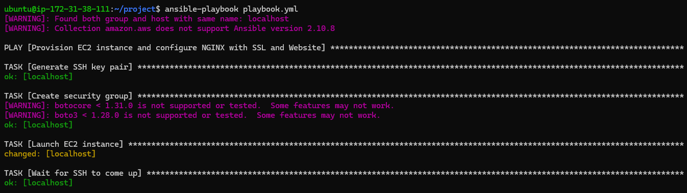
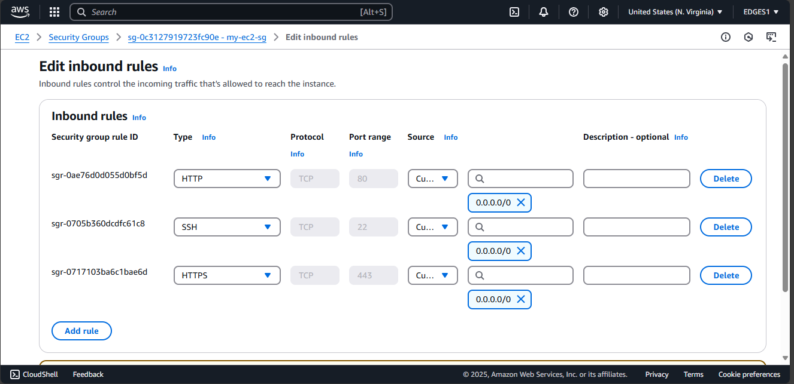

## Overview
This project contains an Ansible playbook to:
- Launch an EC2 instance on AWS.
- Install and configure NGINX to host a website.
- Generate NGINX configuration for two pages `/page1` and `/page2`.
- Serve pages from `/var/www/task1/index.html` and `/var/www/task2/index.html`.
- Automatically generate self-signed SSL certificates.
- Configure NGINX to serve the website over HTTPS.
- Add a public SSH key to the EC2 instance for authentication.

---

## Prerequisites

- AWS account
- AWS CLI configured with your credentials
- Ansible installed on your local machine
- SSH key pair generated (`my-ec2.pem` and `my-ec2.pub` or your custom key)
- Proper IAM permissions to create EC2 instances and manage security groups

---

## Steps Performed

### 1. Launch EC2 Instance + Setup Basic Configuration

- Created an EC2 instance using `ami-0fc5d935ebf8bc3bc` in the `us-east-1` region.
- Instance type: `t2.micro`
- Security group: allows SSH (22), HTTP (80), and HTTPS (443) traffic.

### 2. Install NGINX and Deploy Website

- Updated system packages (`apt-get update`).
- Installed `nginx`.
- Created two web pages:
  - `/page1` available at `/var/www/task1/index.html`
  - `/page2` available at `/var/www/task2/index.html`

### 3. NGINX Configuration

- Generated custom NGINX config to host the website.
- Setup URL paths `/page1` and `/page2` pointing to respective directories.

### 4. SSL Certificate (Self-Signed)

- Automatically generated self-signed SSL certificates.
- Configured NGINX to use these certificates for HTTPS.

### 5. SSH Key Management

- Public SSH key added to the EC2 instance for secure access.

---

## Ansible_Project Files

- `playbook.yml` - Main Ansible playbook to automate the setup.
- `nginx.conf.j2` - Template to generate NGINX configuration.
- `page1.html` - HTML content for `/page1`.
- `page2.html` - HTML content for `/page2`.

---
## How to Run

```
git clone https://github.com/janakniraula/Ansible_Project.git
```

```
cd Ansible_Project
```

```
ansible-playbook playbook.yml
```
---

## Output

- [Page 1](https://18.212.53.124/page1/)
- [Page 2](https://18.212.53.124/page2/)

## Screenshots

### 1. Run ansible playbook


### 2. EC2 instance successfully created


### 3. Security group rules configured (80/443/22)


### 4. Ansible playbook executed successfully


### 5. NGINX installed on EC2


### 6. Self-signed SSL certificate generated


### 7. `/page1` secured with HTTPS


### 8. `/page2` secured with HTTPS


### 9. SSH access using public key

